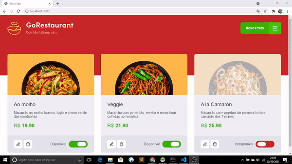

<h1>GoRestaurant</h1>

 
> Sobre o GoRestaurant

O GoRestaurant é uma plataforma de pedidos de pratos
Lá pode cadastrar os pratos, remover e alterar e verificar
qual está disponível ou indisponível.

 

> Tecnologias Ultilizadas

<ul>
  <li>React</li>
  <li>Typescript</li>
  <li>Javascript</li>
  <li>Html</li>
  <li>SASS</li>
</ul>

 
  
  
  
  
  

